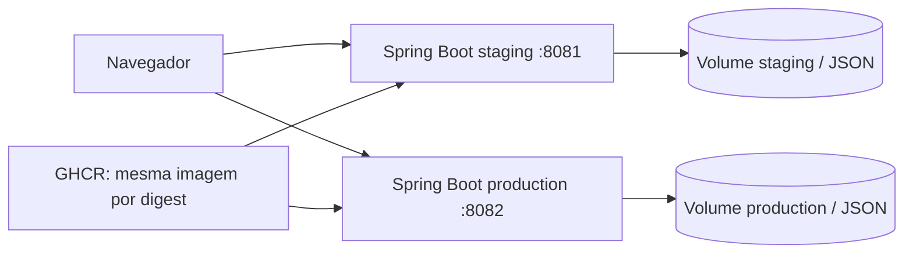
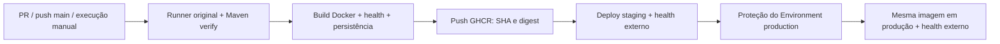

# EcoHospital Smart — ESG com Java Spring Boot e CI/CD

Atividade acadêmica: build, testes e deploy separado em staging e produção.

Integrante identificado nos arquivos originais: **Kalicon Amorim da Cruz Souza — RM 563172**. Outros integrantes: não informados; preencher antes da entrega, se houver.

## Estado comprovado desta entrega

O projeto recebido era Node.js sem framework, com frontend estático e cinco coleções JSON em memória. Para atender à linguagem da atividade, foi acrescentado um backend Java 17 / Spring Boot 3.5.16. O frontend, o dataset e as funções ESG foram preservados. O servidor Node original permanece em `src/server.js` como referência; o backend padrão de entrega é Java.

Em 28/09/2026, foram executados o build Maven, **25 testes JUnit aprovados** e o runner Node original com asserções de CRUD. Dois processos Java locais identificaram `staging` e `production`, serviram a página e o health com HTTP 200, usaram o mesmo JAR e demonstraram isolamento e persistência após reinício. Logs e relatórios estão em [docs/evidence/local](docs/evidence/local).

O repositório público [Kalicon/ecohospital-esg-cicd](https://github.com/Kalicon/ecohospital-esg-cicd) foi criado com autorização. O [CI atualizado aprovado](https://github.com/Kalicon/ecohospital-esg-cicd/actions/runs/36433415005) executou testes, construiu e iniciou a imagem Docker em Ubuntu, verificou UID 10001, health e persistência após reinício, e publicou no GHCR. O [PR de demonstração](https://github.com/Kalicon/ecohospital-esg-cicd/pull/1) foi encerrado sem merge: seu [run com falha proposital](https://github.com/Kalicon/ecohospital-esg-cicd/actions/runs/36433472858) bloqueou a imagem e todos os deploys. Logs e capturas reais estão em `docs/evidence/github`.

**Deploy neste PC ainda pendente:** Docker Desktop foi instalado e WSL 2.7.14 habilitado, mas o Docker informou que a reinicialização do Windows é necessária. Nenhum container de staging/produção foi iniciado neste PC. O usuário escolheu dois ambientes locais, não servidores externos. Os Environments GitHub existem, restritos à `main`, com revisão obrigatória em produção. Os deploys permanecem desabilitados até o engine Linux funcionar.

Imagem publicada do commit `5b00e1eff60e82993258fdec04263a57fb462e49`: `ghcr.io/kalicon/ecohospital-esg-cicd@sha256:443ba973654cfd1cf9b0992f6f746d0c24eb1ef9b4d4a4562f2580c4eba03a3d`. Este digest identifica a imagem construída naquele run, não futuras revisões do código.

O executável standalone oficial Compose 5.5.1 foi usado temporariamente para validar `config` sem daemon Docker. As configurações expandidas confirmam portas, redes e volumes separados; essa checagem não cria containers.

## Tecnologias e arquitetura

Java 17, Spring Boot 3.5.16, Spring MVC, Actuator, Jackson, Maven Wrapper 3.9.16, JUnit 5 / MockMvc, Docker, Compose v2, GitHub Actions, GHCR e SSH. O frontend continua HTML/CSS/JavaScript puro. Node 22 é necessário apenas para o runner histórico no CI; não integra a imagem Java.



A aplicação não dependia de MongoDB real. Mantivemos o modelo de documentos JSON com gravação atômica e volume persistente, evitando acrescentar um banco sem necessidade. O dataset inicial é empacotado dentro do JAR. O estado gravado fica em `/app/data/state.json`. Reinícios preservam alterações; `POST /api/reset` restaura o dataset e sobrescreve o estado desse ambiente. O armazenamento aceita **uma instância por volume**, adequado à demonstração acadêmica; não suporta múltiplos escritores distribuídos. Um estado inválido impede a inicialização, sem apagar o arquivo.

Os scripts `scripts/esg_mongodb_solution.js` e `scripts/esg_mongodb_advanced.js` continuam presentes, mas não são executados pela aplicação ou pelo Compose. Eles contêm limpeza de collections: use somente um MongoDB descartável para estudá-los. As consultas MongoDB exibidas pelo console são equivalentes didáticos às operações realizadas em JSON. Os prints históricos de `ENTREGA_FINAL` pertencem à atividade NoSQL anterior e não comprovam este CI/CD.

Google Fonts é usado pelo frontend; sua indisponibilidade afeta a fonte visual, não a API. O build precisa acessar Maven Central e os registries Docker.

## Execução local com Docker

Pré-requisitos: Docker Engine/Desktop em modo Linux e Docker Compose v2 com suporte a `up --wait` (2.20+). Não é necessário Java instalado para usar Docker. A imagem já foi executada no CI; a execução Docker neste computador aguarda reinicialização do Windows.

PowerShell, na raiz extraída do ZIP:

```powershell
Copy-Item .env.example .env
docker compose config
docker compose up -d --build --wait --wait-timeout 180
Invoke-RestMethod http://localhost:8080/health
Invoke-RestMethod http://localhost:8080/api/status
docker compose ps
docker compose logs app
```

Abra `http://localhost:8080`. Para encerrar preservando dados: `docker compose down`. Não utilize `down -v` se quiser manter o estado, pois essa opção remove o volume.

### Imagem criada pelo Dockerfile

O estágio de build usa `maven:3.9-eclipse-temurin-17`, compila, executa JUnit e produz `target/esg-app.jar`. O estágio final usa `eclipse-temurin:17-jre-jammy`, inclui somente o runtime, o JAR e `curl` para healthcheck. Executa como UID/GID 10001, sem Maven, código-fonte ou Node no runtime. A porta interna é 8080. O healthcheck consulta `/health`; uma aplicação saudável retorna `UP`.

```powershell
docker build --build-arg APP_VERSION=academic-local -t ecohospital:local .
docker run --rm -p 127.0.0.1:8080:8080 -e APP_ENV=local --mount source=ecohospital-manual-data,target=/app/data ecohospital:local
```

`APP_VERSION` registra uma versão de exemplo local; no CI recebe o SHA real do commit. As imagens base usam tags de manutenção. Para reproduzir exatamente um deploy, o pipeline promove a imagem final pelo seu digest SHA256; em uma entrega formal, registrar também os digests das bases usadas.

### Dois ambientes de demonstração no mesmo Docker

Construa a imagem uma vez e use-a nos dois projetos Compose:

```powershell
docker build --build-arg APP_VERSION=academic-local -t ecohospital:local .
Copy-Item deploy/staging.env.example deploy/staging.env
Copy-Item deploy/production.env.example deploy/production.env
docker compose --env-file deploy/staging.env up -d --no-build --wait --wait-timeout 180
docker compose --env-file deploy/production.env up -d --no-build --wait --wait-timeout 180
Invoke-RestMethod http://localhost:8081/health
Invoke-RestMethod http://localhost:8082/health
docker compose --env-file deploy/staging.env ps
docker compose --env-file deploy/production.env ps
```

Os nomes de projeto `ecohospital-staging` e `ecohospital-production` criam redes e volumes distintos. Portas: 8081 e 8082; ambas mapeiam para 8080 no container. Para parar cada ambiente, repita seu comando Compose com `down`. Cada `.env` fica fora do Git/ZIP.

## Build e testes sem Docker

Pré-requisitos: JDK 17+ e acesso à internet no primeiro uso do Wrapper. O projeto foi validado com JDK 17.0.16; o Java padrão deste computador era 25, por isso foi selecionado o JDK 17 existente. Ajuste `JAVA_HOME` para sua instalação, sem copiar caminhos de outro computador.

```powershell
# Windows: se necessário, configure JAVA_HOME antes destes comandos.
.\mvnw.cmd -B -ntp verify
node src/test_mongodb_runner.js
java -jar target/esg-app.jar
```

Linux/macOS: `bash mvnw -B -ntp verify`, depois `java -jar target/esg-app.jar`. Localmente, sem `STORAGE_FILE`, o Java usa memória. Para persistir: `java -jar target/esg-app.jar --app.storage-file=.runtime/local.json`.

No Windows, use PowerShell 7 para os scripts. `.\scripts\verify.ps1` guarda logs do runner e Maven e copia os relatórios XML JUnit. `.\scripts\smoke-local.ps1` inicia dois processos Java em 18081/18082, verifica health, página, versão, isolamento e persistência, e encerra somente os processos iniciados por ele. Ele restaura os seus datasets locais em `.runtime`, sem tocar nos volumes Docker. Os nomes `staging`/`production` neste script identificam configurações locais de demonstração.

Testes JUnit: 20 casos de API/frontend, incluindo casos parametrizados para as cinco coleções e sete consultas; 5 casos de armazenamento (reinício, reset, arquivo inválido, falha de gravação, concorrência e consistência — alguns cenários combinados). O runner original foi mantido e recebeu asserções para detectar divergências. O botão “Validar Dados ESG” mostra um relatório de integridade, não executa Maven dentro do servidor nem afirma ter rodado JUnit.

## Endpoints e configurações

| Endpoint | Uso |
|---|---|
| `GET /` | Frontend ESG original |
| `GET /health` | Status, ambiente e versão da aplicação |
| `GET /actuator/health` | Health padrão Spring Boot |
| `GET /api/status`, `GET /api/kpis` | Identificação e indicadores ESG |
| `GET /api/collections/{name}` | Cinco coleções originais |
| `POST /api/query/preset` | Sete consultas/agregações e duas atualizações; corpo `{"queryId":"read_hospitais_iso"}` |
| `POST /api/telemetria/simular` | Leitura IoT e log automático em violação |
| `POST /api/reset` | Restauração dos dados do ambiente |
| `GET /api/test-runner` | Relatório de integridade sem modificar dados |

Variáveis: `PORT` (8080), `APP_ENV` (local/staging/production), `APP_VERSION` (versão), `STORAGE_FILE` (arquivo de estado). Compose acrescenta `COMPOSE_PROJECT_NAME`, `IMAGE`, `APP_PORT`, `BIND_ADDRESS`. A configuração remota exige `IMAGE` por digest. Não há credenciais de banco porque não há banco externo.

As rotas mutáveis são demonstrações acadêmicas sem autenticação, como no projeto recebido. O Compose publica em loopback por padrão. Para acesso remoto, use um proxy protegido/TLS ou rede restrita do laboratório; publicar em `0.0.0.0` requer controle de acesso no firewall. Não expor o reset publicamente em um serviço real.

## Pipeline GitHub Actions

Arquivos: `.github/workflows/ci-cd.yml`, `.github/workflows/deploy-pc.yml` (PC escolhido) e `.github/workflows/deploy.yml` (alternativa SSH). Alterações somente em README/docs não disparam CI; execução manual continua disponível.



1. `verify`: checa sintaxe JavaScript, executa o runner Node, compila Java, executa JUnit e empacota o JAR. Guarda relatórios mesmo em falha.
2. `image` usa `needs: verify`, constrói a imagem e executa um container para verificar usuário sem root, health, ambiente/versão e persistência após reinício. Falha em qualquer teste impede o push e o deploy. O build Docker também roda JUnit.
3. Somente execuções na `main`, que não sejam pull requests, publicam a imagem testada no GHCR com tag do commit e obtêm o digest real. PRs fazem build/testes, sem deploy.
4. `staging` exige `image` bem-sucedido e variável de repositório `DEPLOY_ENABLED=true`. Faz pull via SSH, sobe Compose, aguarda health e verifica a URL externa (status, ambiente e SHA).
5. `production` exige `image` e `staging` bem-sucedidos e `PRODUCTION_DEPLOY_ENABLED=true`. Usa **o mesmo digest**. O Environment `production` precisa ter revisores obrigatórios configurados na interface do GitHub.

Não há `continue-on-error` em etapas críticas nem `always()` em deploy. `always()` é usado apenas para salvar evidências. Cada ambiente tem exclusão mútua de deploy (`concurrency`, sem cancelar um deploy em andamento). Falha na verificação externa de staging impede a promoção. Falha em produção deixa o job vermelho e exige diagnóstico/rollback; não há rollback automático nem alteração automática do volume.

### Deploy no PC escolhido para a atividade

1. Reinicie manualmente o Windows para concluir WSL; abra Docker Desktop, leia/aceite os termos se concordar e espere o engine Linux. Confirme `docker info --format '{{.OSType}}'` retornando `linux`.
2. Use um runner GitHub Actions Windows x64 com a label `ecohospital-lab`, na conta Windows que executa Docker Desktop. **Repositório público: use runner efêmero somente durante deploys confiáveis da main; nunca execute PRs externos nesse PC.** O CI de PR roda em runners GitHub. O workflow local também exige repository/actor `Kalicon` e branch `main`. A aprovação de todos os PRs externos foi habilitada no repositório. Esses filtros reduzem risco, mas não tornam seguro executar código de terceiros no PC.
3. Habilite as variables `LOCAL_DEPLOY_ENABLED=true` e `LOCAL_PRODUCTION_DEPLOY_ENABLED=true` somente depois do Docker/runner preparados. As duas estão `false` nesta entrega; nenhum runner local foi registrado ainda.
4. Execute CI/CD na main. `staging-pc` faz pull do digest, executa Compose e verifica página/health. `production-pc` depende de staging aprovado, aguarda revisão no Environment production e usa a mesma imagem. Se usar runner `--ephemeral`, registre outro para o segundo job. Não remova a aprovação obrigatória para contornar a espera.
5. `scripts/deploy-local.ps1` mantém Compose/configurações fora do checkout, em `%LOCALAPPDATA%\EcoHospital\deploy\<ambiente>`. Projetos, volumes e redes ficam separados. URLs planejadas: `http://localhost:8081` e `http://localhost:8082`; não são serviços públicos nem deploys concluídos.

O pull usa `GITHUB_TOKEN` temporário do job, com `packages: read`, por stdin; não requer PAT permanente nem secrets SSH para este modo. O deploy remoto opcional abaixo usa secrets por Environment. Não versionar credenciais ou a configuração do runner. Uma aprovação de produção pode ser feita pelo próprio integrante para esta demonstração individual; separação de responsabilidades exigiria outro revisor.

### Alternativa: o que configurar para deploy remoto por SSH

1. O repositório da atividade já existe e recebeu o código. Para outro repositório, ajuste o filtro repository/actor no workflow local. Antes do push confira `git status` e não adicione `.env`, chaves ou tokens.
2. Habilite Actions e permissão de publicação de packages para o `GITHUB_TOKEN`. O pipeline usa esse token para o push GHCR; não precisa de PAT para publicar pelo CI. Ajuste permissões do package se já existir.
3. Crie Environments **staging** e **production**. Restrinja ambos à branch `main`; em production, configure required reviewers e, quando disponível, impedir autoaprovação. Essas regras não são criadas pelo YAML. A disponibilidade varia com plano/visibilidade do repositório.
4. Prepare um ou dois servidores Linux amd64 com Bash, tar, Python 3, Docker e Compose 2.20+. O usuário SSH deve poder executar Docker e gravar em `/opt/ecohospital`. No servidor, um administrador pode executar `sudo install -d -m 0750 -o <usuario> -g <grupo> /opt/ecohospital` com valores reais. O acesso ao daemon Docker concede poderes administrativos e deve usar uma conta de deploy dedicada.
5. Cadastre os secrets abaixo **em cada Environment**, usando credenciais próprias para cada servidor/ambiente. Configure URLs reais alcançáveis pelo runner e liberação de rede SSH/HTTP; com loopback padrão, um proxy precisa encaminhar para 8081/8082. Confirme a chave pública do host por um canal confiável antes de montar `SSH_KNOWN_HOSTS`.
6. Habilite `DEPLOY_ENABLED=true` nas variables do repositório quando staging estiver preparado. Depois configure a aprovação de production e habilite `PRODUCTION_DEPLOY_ENABLED=true`. Sem essas variáveis, CI e publicação funcionam, mas os deploys ficam skipped.

| Secret de cada Environment | Valor necessário |
|---|---|
| `SSH_HOST` | IP ou hostname real do servidor Linux |
| `SSH_USER` | Usuário de deploy |
| `SSH_PORT` | Porta SSH, normalmente 22 |
| `SSH_PRIVATE_KEY` | Chave privada da conta de deploy (formato OpenSSH) |
| `SSH_KNOWN_HOSTS` | Linha(s) de known_hosts com a chave verificada; porta não padrão usa `[host]:porta` |
| `GHCR_USER` | Conta autorizada a ler o package |
| `GHCR_TOKEN` | Token `read:packages` para pull privado, com acesso ao package e SSO se aplicável |

| Variable de cada Environment | Staging | Produção |
|---|---|---|
| `APP_PORT` | `8081` | `8082` |
| `BIND_ADDRESS` | `127.0.0.1` com proxy; `0.0.0.0` só em rede controlada | Mesmo critério |
| `APP_URL` | URL real de staging, sem `/health` | URL real de produção, sem `/health` |

Exemplos de configuração não são URLs de deploy concluído. O SSH usa checagem estrita de host; tokens são enviados por stdin sobre SSH. O servidor mantém autenticação Docker para pull; proteja a conta e o seu `~/.docker/config.json`, preferencialmente com credential helper. Os scripts não imprimem chaves/tokens.

### Rollback e operação

No servidor, o deploy grava `/opt/ecohospital/<ambiente>/compose.yml`, `.env`, `image.txt`, `previous-image.txt` e `health.json`. Diretórios, projetos Compose e volumes são separados por ambiente. O deploy preserva o volume e atualiza o container; não oferece zero downtime.

Para rollback manual, confirme o digest de `previous-image.txt`, altere apenas `IMAGE` no `.env` daquele ambiente e execute no diretório correspondente:

```bash
docker compose -f compose.yml pull
docker compose -f compose.yml up -d --no-build --wait --wait-timeout 180
docker compose -f compose.yml exec -T app curl --fail http://localhost:8080/health
```

Confira versão e ambiente, registre o incidente e preserve o volume. O rollback do container não desfaz mudanças de dados. Antes de futuras mudanças de formato, faça backup do arquivo do volume.

## Evidências e documentação

- [Documentação técnica editável](docs/documentacao-tecnica.md) e `docs/EcoHospital_CICD.pdf`: título, integrante, arquitetura, imagem, lógica do pipeline, resultados, desafios e espaços identificados para prints reais.
- [Registro de verificação](docs/VERIFICACAO.md): comandos, resultados, falha inicial corrigida e limitações.
- [Inventário de alterações](docs/ALTERACOES.md): arquivos acrescentados/alterados e preservados.
- `docs/evidence/local`: logs reais, XML JUnit e JSON health/status da demonstração local.
- `docs/evidence/README.md`: roteiro para obter prints reais do Actions/Docker/staging/production.

Registro das evidências:

| Evidência requerida | Referência |
|---|---|
| Run GitHub Actions com build/testes aprovados | [Run aprovado](https://github.com/Kalicon/ecohospital-esg-cicd/actions/runs/36433415005), logs e `03-updated-ci-success.png` |
| Imagem no GHCR e digest | Digest acima; log `updated-actions-run.log` |
| Container e volume em execução | Verificados no job image do CI; health/KPIs reais em `github/container-first-run`. Compose neste PC ainda pendente |
| Staging Docker no PC | **PENDENTE** — reiniciar Windows, iniciar engine, executar job e capturar página/health |
| Aprovação e produção Docker no PC | **PENDENTE** — runner, aprovação e execução real após staging |
| Falha de teste bloqueando deploy | [Run falho](https://github.com/Kalicon/ecohospital-esg-cicd/actions/runs/36433472858), `test-gate-run.json/.log` e `02-test-gate-failure.png` |

Não reutilizar os prints MongoDB anteriores como prova do pipeline. Os JSON locais são resultados HTTP reais, mas não screenshots de servidores remotos.

## Entrega ZIP

Execute `.\scripts\package-delivery.ps1` no PowerShell. Ele inclui Java/testes, backend Node original, frontend, dados, scripts MongoDB, arquivos Docker, workflows, Wrapper, configurações de exemplo, README, documentação PDF e evidências disponíveis. Não inclui `.env` reais, `.git`, `target`, `.runtime`, ferramentas temporárias nem ZIPs anteriores. Os modelos SQL/XML e documentos da atividade NoSQL anterior permanecem na pasta original; não são dependências da aplicação e não integram este pacote CI/CD.

O ZIP é criado em `delivery/EcoHospital_CICD.zip`, com manifesto de arquivos e SHA256. Não sobrescreve um ZIP anterior silenciosamente: mova/renomeie a versão antiga antes de regenerar. Após novos prints ou revisão de integrantes, regenere o PDF e o pacote. O PDF pode ser regenerado com Python + `reportlab` 4.x: `python scripts/generate-technical-pdf.py`.

Esta revisão com CI real usa `delivery/EcoHospital_CICD-executado.zip`. Reproduzir: `.\scripts\package-delivery.ps1 -OutputName EcoHospital_CICD-executado.zip`, seguido de `python scripts/verify-delivery.py delivery/EcoHospital_CICD-executado.zip`. Para continuar após reiniciar Windows, consulte [docs/RETOMADA.md](docs/RETOMADA.md).

## Checklist do enunciado

- [x] Estrutura, linguagem, framework original, testes e configurações examinados; plano apresentado antes das alterações.
- [x] Backend Java Spring Boot implementado com funcionalidades ESG preservadas e health check HTTP verificado.
- [x] Testes existentes executados e fortalecidos; 25 testes JUnit aprovados; JAR gerado.
- [x] Dockerfile e `.dockerignore` preparados, com comandos e explicação da imagem.
- [x] Imagem Docker construída e container executado com evidência real no GitHub Actions.
- [x] Compose, rede, volume e exemplos de variáveis preparados; isolamento local Java verificado.
- [ ] Compose, rede e volumes validados em Docker real.
- [x] Workflows CI/CD preparados e validados estaticamente, com dependências e secrets por Environment.
- [x] Pipeline executado no GitHub, imagem publicada e falha de teste demonstrada bloqueando deploy.
- [ ] Deploy staging Docker no PC concluído com evidências reais.
- [ ] Deploy produção Docker no PC aprovado e concluído com evidências reais.
- [x] README e conteúdo da documentação técnica preparados com espaços para evidências.
- [x] Prints reais de Actions aprovado e falha proposital registrados; build Docker comprovado pelos logs.
- [ ] Prints reais de staging e produção Docker no PC inseridos.
- [x] PDF gerado e pacote ZIP conferido com CRC e manifesto SHA256.

## Referências oficiais

[Requisitos Spring Boot 3.5](https://docs.spring.io/spring-boot/3.5/system-requirements.html), [Environments e proteção de deploy no GitHub](https://docs.github.com/en/actions/reference/workflows-and-actions/deployments-and-environments), [Disponibilidade de aprovação por plano/visibilidade](https://docs.github.com/en/actions/how-tos/deploy/configure-and-manage-deployments/review-deployments). As versões Maven/Spring foram confirmadas no Maven Central durante a preparação.
