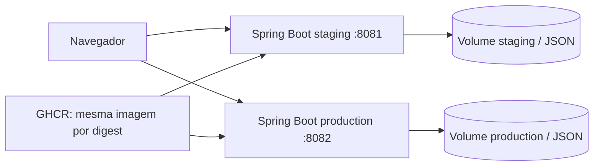
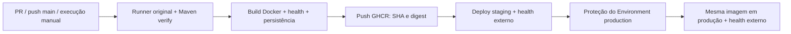

# EcoHospital Smart — ESG com Java Spring Boot e CI/CD

Atividade acadêmica: build, testes e deploy separado em staging e produção.

Integrante identificado nos arquivos originais: **Kalicon Amorim da Cruz Souza — RM 563172**. Outros integrantes: não informados; preencher antes da entrega, se houver.

## Estado comprovado desta entrega

O projeto recebido era Node.js sem framework, com frontend estático e cinco coleções JSON em memória. Para atender à linguagem da atividade, foi acrescentado um backend Java 17 / Spring Boot 3.5.16. O frontend, o dataset e as funções ESG foram preservados. O servidor Node original permanece em `src/server.js` como referência; o backend padrão de entrega é Java.

**Evolução adicional (branch de melhoria):** rotas de escrita protegidas por token de operador, cabeçalhos de segurança, painel com taxa de conformidade e fontes prioritárias calculadas sobre as leituras, e PostgreSQL JSONB opcional. Em teste local desta revisão, 30 testes JUnit passaram; um terceiro Compose em `localhost:8083` importou uma cópia do staging (11 leituras), negou escrita sem token (HTTP 401) e preservou a 12ª leitura após reinício. Isso **não** significa que o CI/CD ou os dois ambientes já tenham sido atualizados: os deploys documentados abaixo ainda são da revisão anterior até a nova promoção ser comprovada.

Em 28/09/2026, foram executados o build Maven, **25 testes JUnit aprovados** e o runner Node original com asserções de CRUD. Dois processos Java locais identificaram `staging` e `production`, serviram a página e o health com HTTP 200, usaram o mesmo JAR e demonstraram isolamento e persistência após reinício. Logs e relatórios estão em [docs/evidence/local](docs/evidence/local).

O repositório público [Kalicon/ecohospital-esg-cicd](https://github.com/Kalicon/ecohospital-esg-cicd) foi criado com autorização. O [CI atualizado aprovado](https://github.com/Kalicon/ecohospital-esg-cicd/actions/runs/36433415005) executou testes, construiu e iniciou a imagem Docker em Ubuntu, verificou UID 10001, health e persistência após reinício, e publicou no GHCR. O [PR de demonstração](https://github.com/Kalicon/ecohospital-esg-cicd/pull/1) foi encerrado sem merge: seu [run com falha proposital](https://github.com/Kalicon/ecohospital-esg-cicd/actions/runs/36433472858) bloqueou a imagem e todos os deploys. Logs e capturas reais estão em `docs/evidence/github`.

**Dois ambientes Docker concluídos no PC:** após reiniciar o Windows, Docker Desktop iniciou em modo Linux 29.8.1 / Compose 5.5.1. O [run completo de CI/CD](https://github.com/Kalicon/ecohospital-esg-cicd/actions/runs/36438015592) aprovou verify, image, staging-pc e production-pc. Kalicon aprovou o Environment production no GitHub antes do segundo deploy. Staging serve `http://localhost:8081`; produção, `http://localhost:8082`. Ambos retornam health `UP`, mesma versão `461ffa3eea37b904018856681c4fbea1cdc2c8b8` e mesma imagem `ghcr.io/kalicon/ecohospital-esg-cicd@sha256:6a170c3d0f26560afa548a895a67f0f8b8e32481d4a7dc016cc57a7b32b94086`. A verificação cruzada comprovou UID 10001, redes/volumes separados, isolamento e persistência após reinício de staging. JSON e capturas reais em `docs/evidence/pc`. São dois ambientes no mesmo PC, não servidores ou URLs públicos.

Imagem publicada do commit `5b00e1eff60e82993258fdec04263a57fb462e49`: `ghcr.io/kalicon/ecohospital-esg-cicd@sha256:443ba973654cfd1cf9b0992f6f746d0c24eb1ef9b4d4a4562f2580c4eba03a3d`. Este digest identifica a imagem construída naquele run, não futuras revisões do código.

O executável standalone oficial Compose 5.5.1 foi usado temporariamente para validar `config` sem daemon Docker. As configurações expandidas confirmam portas, redes e volumes separados; essa checagem não cria containers.

## Tecnologias e arquitetura

Java 17, Spring Boot 3.5.16, Spring MVC, Actuator, Jackson, Maven Wrapper 3.9.16, JUnit 5 / MockMvc, Docker, Compose v2, GitHub Actions, GHCR e SSH. O frontend continua HTML/CSS/JavaScript puro. Node 22 é necessário apenas para o runner histórico no CI; não integra a imagem Java.



A aplicação não dependia de MongoDB real. JSON com gravação atômica e volume persistente permanece o padrão para os dois ambientes originais. O dataset inicial é empacotado dentro do JAR. O estado gravado fica em `/app/data/state.json`. Reinícios preservam alterações; `POST /api/reset` restaura o dataset e sobrescreve o estado desse ambiente. O armazenamento JSON aceita **uma instância por volume**; um estado inválido impede a inicialização, sem apagar o arquivo. PostgreSQL JSONB agora é opt-in (`APP_STORAGE=postgres`): guarda o mesmo documento em uma linha transacional, serializa escritas com `SELECT ... FOR UPDATE` e importa `state.json` apenas quando o banco está vazio. A importação não apaga o arquivo de origem.

Os scripts `scripts/esg_mongodb_solution.js` e `scripts/esg_mongodb_advanced.js` continuam presentes, mas não são executados pela aplicação ou pelo Compose. Eles contêm limpeza de collections: use somente um MongoDB descartável para estudá-los. As consultas MongoDB exibidas pelo console são equivalentes didáticos às operações realizadas em JSON. Os prints históricos de `ENTREGA_FINAL` pertencem à atividade NoSQL anterior e não comprovam este CI/CD.

O frontend usa fontes do sistema e uma fotografia empacotada, sem depender de Google Fonts. O build precisa acessar Maven Central e os registries Docker.

### Revisão visual inspirada em Monsoon

A abertura traz paisagem clara, navegação translúcida em cápsula, título editorial e atalhos para as abas reais do painel. O painel usa ícones SVG no lugar de emojis, hierarquia de informações, foco visível, mensagens de erro junto às ações e confirmação nativa antes de restaurar dados. A stack HTML/CSS/JavaScript foi mantida para preservar as APIs e o build Java. Não é uma reprodução pixel a pixel nem migração para React.

A fotografia `public/hero-landscape-v2.jpg` é de [A.T.M. Arafath Ali no Unsplash](https://unsplash.com/photos/misty-hills-with-trees-at-sunrise-mGp2_4MeGIw), sob a [licença Unsplash](https://unsplash.com/license). A filmagem do exemplo Monsoon não integra a entrega: os [termos Scrolltide](https://www.scrolltide.co/terms) restringem reutilização de filmagens de demonstração. A referência fornecida foi adaptada para o domínio ESG, sem patrocinadores fictícios ou métricas inventadas. Esta revisão está no ambiente de avaliação `http://localhost:8083`; staging e produção não devem ser considerados atualizados até nova evidência de promoção.

## Execução local com Docker

Pré-requisitos: Docker Engine/Desktop em modo Linux e Docker Compose v2 com suporte a `up --wait` (2.20+). Não é necessário Java instalado para usar Docker. A imagem foi executada no CI e o Compose de staging foi executado neste PC.

PowerShell, na raiz extraída do ZIP:

```powershell
Copy-Item .env.example .env
.\scripts\init-local-secrets.ps1
docker compose config
docker compose up -d --build --wait --wait-timeout 180
Invoke-RestMethod http://localhost:8080/health
Invoke-RestMethod http://localhost:8080/api/status
docker compose ps
docker compose logs app
```

Abra `http://localhost:8080`. Para encerrar preservando dados: `docker compose down`. Não utilize `down -v` se quiser manter o estado, pois essa opção remove o volume.

Para alterar dados no painel, leia o token local em `.tools/secrets/operator_token.txt`, digite-o no campo “Token do operador” e clique “Ativar”. Ele fica somente na memória da aba; não é salvo no navegador. O arquivo é ignorado pelo Git e não entra no ZIP. Sem token, leituras e consultas continuam disponíveis, mas simulação, reset e os dois presets `update_` retornam 401 (ou 503 se o servidor foi iniciado sem token configurado). Cada ambiente deve usar token diferente. Não publique o serviço sem TLS e controle de acesso de rede.

### PostgreSQL opcional e migração segura

O Compose `docker-compose.postgres.yml` sobe app + PostgreSQL 17 em rede privada, com volume persistente e segredos montados como arquivos. O banco não expõe porta no host. Na primeira criação do banco, importa `deploy/import/state.json` se ele existir; caso contrário, usa o seed do JAR. Em inicializações posteriores, o arquivo de importação é ignorado e os dados existentes prevalecem. Para testar com uma cópia de staging sem tocar no volume original:

```powershell
.\scripts\init-local-secrets.ps1
docker cp ecohospital-staging-app-1:/app/data/state.json deploy/import/state.json
$env:COMPOSE_PROJECT_NAME='ecohospital-postgres-demo'
$env:APP_ENV='postgres-demo'
$env:APP_PORT='8083'
docker compose -f docker-compose.postgres.yml up -d --build --wait --wait-timeout 240
Invoke-RestMethod http://localhost:8083/api/status
```

O `docker cp` é apenas exemplo para este PC; em outro host, copie um backup validado para `deploy/import/state.json`. Esse arquivo é ignorado pelo Git. Faça backup antes de qualquer migração e compare as contagens das cinco coleções. Não use `down -v` no PostgreSQL: isso removeria o volume do banco. A opção PostgreSQL foi validada em ambiente isolado; não muda automaticamente staging/produção.

### Imagem criada pelo Dockerfile

O estágio de build usa `maven:3.9-eclipse-temurin-17`, compila, executa JUnit e produz `target/esg-app.jar`. O estágio final usa `eclipse-temurin:17-jre-jammy`, inclui somente o runtime, o JAR e `curl` para healthcheck. Executa como UID/GID 10001, sem Maven, código-fonte ou Node no runtime. A porta interna é 8080. O healthcheck consulta `/health`; uma aplicação saudável retorna `UP`.

```powershell
docker build --build-arg APP_VERSION=academic-local -t ecohospital:local .
docker run --rm -p 127.0.0.1:8080:8080 -e APP_ENV=local --mount source=ecohospital-manual-data,target=/app/data ecohospital:local
```

`APP_VERSION` registra uma versão de exemplo local; no CI recebe o SHA real do commit. As imagens base usam tags de manutenção. Para reproduzir exatamente um deploy, o pipeline promove a imagem final pelo seu digest SHA256; em uma entrega formal, registrar também os digests das bases usadas.

### Dois ambientes de demonstração no mesmo Docker

Construa a imagem uma vez e use-a nos dois projetos Compose:

```powershell
docker build --build-arg APP_VERSION=academic-local -t ecohospital:local .
Copy-Item deploy/staging.env.example deploy/staging.env
Copy-Item deploy/production.env.example deploy/production.env
docker compose --env-file deploy/staging.env up -d --no-build --wait --wait-timeout 180
docker compose --env-file deploy/production.env up -d --no-build --wait --wait-timeout 180
Invoke-RestMethod http://localhost:8081/health
Invoke-RestMethod http://localhost:8082/health
docker compose --env-file deploy/staging.env ps
docker compose --env-file deploy/production.env ps
```

Os nomes de projeto `ecohospital-staging` e `ecohospital-production` criam redes e volumes distintos. Portas: 8081 e 8082; ambas mapeiam para 8080 no container. Para parar cada ambiente, repita seu comando Compose com `down`. Cada `.env` fica fora do Git/ZIP.

## Build e testes sem Docker

Pré-requisitos: JDK 17+ e acesso à internet no primeiro uso do Wrapper. O projeto foi validado com JDK 17.0.16; o Java padrão deste computador era 25, por isso foi selecionado o JDK 17 existente. Ajuste `JAVA_HOME` para sua instalação, sem copiar caminhos de outro computador.

```powershell
# Windows: se necessário, configure JAVA_HOME antes destes comandos.
.\mvnw.cmd -B -ntp verify
node src/test_mongodb_runner.js
java -jar target/esg-app.jar
```

Linux/macOS: `bash mvnw -B -ntp verify`, depois `java -jar target/esg-app.jar`. Localmente, sem `STORAGE_FILE`, o Java usa memória. Para persistir: `java -jar target/esg-app.jar --app.storage-file=.runtime/local.json`.

No Windows, use PowerShell 7 para os scripts. `.\scripts\verify.ps1` guarda logs do runner e Maven e copia os relatórios XML JUnit. `.\scripts\smoke-local.ps1` inicia dois processos Java em 18081/18082, verifica health, página, versão, isolamento e persistência, e encerra somente os processos iniciados por ele. Ele restaura os seus datasets locais em `.runtime`, sem tocar nos volumes Docker. Os nomes `staging`/`production` neste script identificam configurações locais de demonstração.

Testes JUnit nesta revisão: 22 casos de API/frontend (incluindo autorização e fórmula dos indicadores), 5 de armazenamento JSON (reinício, reset, arquivo inválido, falha de gravação, concorrência e consistência — alguns cenários combinados) e 3 de política do token. O runner original foi mantido e recebeu asserções para detectar divergências. O botão “Validar Dados ESG” mostra um relatório de integridade, não executa Maven dentro do servidor nem afirma ter rodado JUnit. O pipeline também inclui smoke test com PostgreSQL real.

## Endpoints e configurações

| Endpoint | Uso |
|---|---|
| `GET /` | Frontend ESG original |
| `GET /health` | Status, ambiente e versão da aplicação |
| `GET /actuator/health` | Health padrão Spring Boot |
| `GET /api/status`, `GET /api/kpis`, `GET /api/insights` | Identificação, KPIs e indicadores observados com fórmula explícita |
| `GET /api/collections/{name}` | Cinco coleções originais |
| `POST /api/query/preset` | Sete consultas/agregações e duas atualizações; corpo `{"queryId":"read_hospitais_iso"}`; atualizações exigem token |
| `POST /api/telemetria/simular` | Leitura IoT e log automático em violação; exige token |
| `POST /api/reset` | Restauração dos dados do ambiente; exige token e confirmação no painel |
| `GET /api/test-runner` | Relatório de integridade sem modificar dados |

Variáveis: `PORT` (8080), `APP_ENV` (local/staging/production), `APP_VERSION` (versão), `APP_STORAGE` (`json` padrão ou `postgres`), `STORAGE_FILE` (arquivo de estado ou origem da importação), `APP_WRITE_TOKEN_FILE` (arquivo do token). O modo PostgreSQL usa `POSTGRES_JDBC_URL`, `POSTGRES_USER` e `POSTGRES_PASSWORD_FILE`. Compose acrescenta `COMPOSE_PROJECT_NAME`, `IMAGE`, `APP_PORT`, `BIND_ADDRESS`. A configuração remota exige `IMAGE` por digest.

As rotas mutáveis exigem o cabeçalho `X-Operator-Key`; o segredo é montado como arquivo no container e não entra na imagem nem no repositório. As leituras são públicas para este laboratório. O Compose publica em loopback por padrão. Para acesso remoto, use proxy com TLS e autenticação de usuário ou rede restrita; o token compartilhado não substitui contas individuais e trilha de auditoria. Publicar em `0.0.0.0` requer controle de acesso no firewall.

## Pipeline GitHub Actions

Arquivos: `.github/workflows/ci-cd.yml`, `.github/workflows/deploy-pc.yml` (PC escolhido) e `.github/workflows/deploy.yml` (alternativa SSH). Alterações somente em README/docs não disparam CI; execução manual continua disponível.



1. `verify`: checa sintaxe JavaScript, executa o runner Node, compila Java, executa JUnit e empacota o JAR. Guarda relatórios mesmo em falha.
2. `image` usa `needs: verify`, constrói a imagem e executa um container JSON para verificar usuário sem root, health, ambiente/versão, autorização e persistência após reinício. Também sobe PostgreSQL real em Compose e verifica autorização e persistência. Falha em qualquer teste impede o push e o deploy. O build Docker também roda JUnit.
3. Somente execuções na `main`, que não sejam pull requests, publicam a imagem testada no GHCR com tag do commit e obtêm o digest real. PRs fazem build/testes, sem deploy.
4. `staging` exige `image` bem-sucedido e variável de repositório `DEPLOY_ENABLED=true`. Faz pull via SSH, sobe Compose, aguarda health e verifica a URL externa (status, ambiente e SHA).
5. `production` exige `image` e `staging` bem-sucedidos e `PRODUCTION_DEPLOY_ENABLED=true`. Usa **o mesmo digest**. O Environment `production` precisa ter revisores obrigatórios configurados na interface do GitHub.

Não há `continue-on-error` em etapas críticas nem `always()` em deploy. `always()` é usado apenas para salvar evidências. Cada ambiente tem exclusão mútua de deploy (`concurrency`, sem cancelar um deploy em andamento). Falha na verificação externa de staging impede a promoção. Falha em produção deixa o job vermelho e exige diagnóstico/rollback; não há rollback automático nem alteração automática do volume.

### Deploy no PC escolhido para a atividade

1. Recurso WSL concluído e Docker Desktop iniciado: `docker info --format '{{.OSType}}'` retornou `linux` nesta execução.
2. Use um runner GitHub Actions Windows x64 com a label `ecohospital-lab`, na conta Windows que executa Docker Desktop. **Repositório público: use runner efêmero somente durante deploys confiáveis da main; nunca execute PRs externos nesse PC.** O CI de PR roda em runners GitHub. O workflow local também exige repository/actor `Kalicon` e branch `main`. A aprovação de todos os PRs externos foi habilitada no repositório. Esses filtros reduzem risco, mas não tornam seguro executar código de terceiros no PC.
3. Variables `LOCAL_DEPLOY_ENABLED=true` e `LOCAL_PRODUCTION_DEPLOY_ENABLED=true` foram habilitadas após o Docker funcionar. Runners efêmeros separados executaram um job cada e se removeram do GitHub.
   Durante o desenvolvimento desta revisão, ambas foram temporariamente definidas como `false`; reabilite-as somente quando os novos runners e os segredos de cada Environment estiverem prontos.
4. O CI/CD executado na main promoveu o digest para `staging-pc`, aguardou a revisão no Environment production e promoveu a mesma imagem para `production-pc`. Para repetir, registre dois novos runners efêmeros com `scripts/lab-runner.ps1 -Mode Start -EnvironmentName staging` e `production`, depois dispare o workflow. Não remova a aprovação obrigatória.
5. `scripts/deploy-local.ps1` mantém Compose/configurações fora do checkout, em `%LOCALAPPDATA%\EcoHospital\deploy\<ambiente>`. Projetos, volumes e redes ficam separados. URLs planejadas: `http://localhost:8081` e `http://localhost:8082`; não são serviços públicos nem deploys concluídos.

O pacote GHCR é público; o deploy local faz pull anônimo pelo digest, sem PAT, senha ou login persistente. O `GITHUB_TOKEN` é usado apenas pelas actions normais de checkout/publicação. O deploy remoto opcional abaixo usa secrets por Environment. Não versionar credenciais ou configuração do runner. Uma aprovação de produção pode ser feita pelo próprio integrante nesta demonstração individual; separação de responsabilidades exigiria outro revisor.

Para a revisão com autorização de escrita, execute `./scripts/provision-lab-operator-secrets.ps1 -PublishToGitHub` no PowerShell autenticado no `gh`. O script gera tokens distintos fora do repositório, em `%LOCALAPPDATA%\EcoHospital\operator-keys`, e publica `APP_WRITE_TOKEN` nos Environments staging e production sem exibir valores. O workflow grava cada segredo como arquivo local ao fazer o deploy. Para operar o painel, use o token do arquivo correspondente ao ambiente.

### Alternativa: o que configurar para deploy remoto por SSH

1. O repositório da atividade já existe e recebeu o código. Para outro repositório, ajuste o filtro repository/actor no workflow local. Antes do push confira `git status` e não adicione `.env`, chaves ou tokens.
2. Habilite Actions e permissão de publicação de packages para o `GITHUB_TOKEN`. O pipeline usa esse token para o push GHCR; não precisa de PAT para publicar pelo CI. Ajuste permissões do package se já existir.
3. Crie Environments **staging** e **production**. Restrinja ambos à branch `main`; em production, configure required reviewers e, quando disponível, impedir autoaprovação. Essas regras não são criadas pelo YAML. A disponibilidade varia com plano/visibilidade do repositório.
4. Prepare um ou dois servidores Linux amd64 com Bash, tar, Python 3, Docker e Compose 2.20+. O usuário SSH deve poder executar Docker e gravar em `/opt/ecohospital`. No servidor, um administrador pode executar `sudo install -d -m 0750 -o <usuario> -g <grupo> /opt/ecohospital` com valores reais. O acesso ao daemon Docker concede poderes administrativos e deve usar uma conta de deploy dedicada.
5. Cadastre os secrets abaixo **em cada Environment**, usando credenciais próprias para cada servidor/ambiente. Configure URLs reais alcançáveis pelo runner e liberação de rede SSH/HTTP; com loopback padrão, um proxy precisa encaminhar para 8081/8082. Confirme a chave pública do host por um canal confiável antes de montar `SSH_KNOWN_HOSTS`.
6. Habilite `DEPLOY_ENABLED=true` nas variables do repositório quando staging estiver preparado. Depois configure a aprovação de production e habilite `PRODUCTION_DEPLOY_ENABLED=true`. Sem essas variáveis, CI e publicação funcionam, mas os deploys ficam skipped.

| Secret de cada Environment | Valor necessário |
|---|---|
| `SSH_HOST` | IP ou hostname real do servidor Linux |
| `SSH_USER` | Usuário de deploy |
| `SSH_PORT` | Porta SSH, normalmente 22 |
| `SSH_PRIVATE_KEY` | Chave privada da conta de deploy (formato OpenSSH) |
| `SSH_KNOWN_HOSTS` | Linha(s) de known_hosts com a chave verificada; porta não padrão usa `[host]:porta` |
| `GHCR_USER` | Conta autorizada a ler o package |
| `GHCR_TOKEN` | Token `read:packages` para pull privado, com acesso ao package e SSO se aplicável |
| `APP_WRITE_TOKEN` | Token distinto de operador, com no mínimo 32 caracteres; enviado por SSH e gravado como arquivo 0600 |

| Variable de cada Environment | Staging | Produção |
|---|---|---|
| `APP_PORT` | `8081` | `8082` |
| `BIND_ADDRESS` | `127.0.0.1` com proxy; `0.0.0.0` só em rede controlada | Mesmo critério |
| `APP_URL` | URL real de staging, sem `/health` | URL real de produção, sem `/health` |

Exemplos de configuração não são URLs de deploy concluído. O SSH usa checagem estrita de host; tokens são enviados por stdin sobre SSH. O servidor mantém autenticação Docker para pull; proteja a conta e o seu `~/.docker/config.json`, preferencialmente com credential helper. Os scripts não imprimem chaves/tokens.

### Rollback e operação

No servidor, o deploy grava `/opt/ecohospital/<ambiente>/compose.yml`, `.env`, `image.txt`, `previous-image.txt` e `health.json`. Diretórios, projetos Compose e volumes são separados por ambiente. O deploy preserva o volume e atualiza o container; não oferece zero downtime.

Para rollback manual, confirme o digest de `previous-image.txt`, altere apenas `IMAGE` no `.env` daquele ambiente e execute no diretório correspondente:

```bash
docker compose -f compose.yml pull
docker compose -f compose.yml up -d --no-build --wait --wait-timeout 180
docker compose -f compose.yml exec -T app curl --fail http://localhost:8080/health
```

Confira versão e ambiente, registre o incidente e preserve o volume. O rollback do container não desfaz mudanças de dados. Antes de futuras mudanças de formato, faça backup do arquivo do volume.

## Evidências e documentação

- [Documentação técnica editável](docs/documentacao-tecnica.md) e `docs/EcoHospital_CICD.pdf`: título, integrante, arquitetura, imagem, lógica do pipeline, resultados, desafios e espaços identificados para prints reais.
- [Registro de verificação](docs/VERIFICACAO.md): comandos, resultados, falha inicial corrigida e limitações.
- [Inventário de alterações](docs/ALTERACOES.md): arquivos acrescentados/alterados e preservados.
- `docs/evidence/local`: logs reais, XML JUnit e JSON health/status da demonstração local.
- `docs/evidence/README.md`: roteiro para obter prints reais do Actions/Docker/staging/production.

Registro das evidências:

| Evidência requerida | Referência |
|---|---|
| Run GitHub Actions com build/testes aprovados | [Run aprovado](https://github.com/Kalicon/ecohospital-esg-cicd/actions/runs/36433415005), logs e `03-updated-ci-success.png` |
| Imagem no GHCR e digest | Digest acima; log `updated-actions-run.log` |
| Container e volume em execução | Verificados no job image do CI e staging Compose neste PC; `pc/staging-health.json`, `pc/staging-dashboard.png` |
| Staging Docker no PC | [Job staging-pc aprovado](https://github.com/Kalicon/ecohospital-esg-cicd/actions/runs/36438015592), porta 8081, health e captura real |
| Aprovação e produção Docker no PC | [Mesmo run aprovado](https://github.com/Kalicon/ecohospital-esg-cicd/actions/runs/36438015592); `pc/production-dashboard.png`, `pc/production-health.json`, `github/production-approval.json` |
| Isolamento e persistência | `pc/docker-isolation-persistence.json`: staging 10→11→11 após reinício; produção 10→10 |
| Falha de teste bloqueando deploy | [Run falho](https://github.com/Kalicon/ecohospital-esg-cicd/actions/runs/36433472858), `test-gate-run.json/.log` e `02-test-gate-failure.png` |

Não reutilizar os prints MongoDB anteriores como prova do pipeline. Os JSON locais são resultados HTTP reais, mas não screenshots de servidores remotos.

## Entrega ZIP

Execute `.\scripts\package-delivery.ps1` no PowerShell. Ele inclui Java/testes, backend Node original, frontend, dados, scripts MongoDB, arquivos Docker, workflows, Wrapper, configurações de exemplo, README, documentação PDF e evidências disponíveis. Não inclui `.env` reais, `.git`, `target`, `.runtime`, ferramentas temporárias nem ZIPs anteriores. Os modelos SQL/XML e documentos da atividade NoSQL anterior permanecem na pasta original; não são dependências da aplicação e não integram este pacote CI/CD.

O ZIP é criado em `delivery/EcoHospital_CICD.zip`, com manifesto de arquivos e SHA256. Não sobrescreve um ZIP anterior silenciosamente: mova/renomeie a versão antiga antes de regenerar. Após novos prints ou revisão de integrantes, regenere o PDF e o pacote. O PDF pode ser regenerado com Python + `reportlab` 4.x: `python scripts/generate-technical-pdf.py`.

Esta revisão final com os dois deploys usa `delivery/EcoHospital_CICD-final.zip`. Reproduzir: `.\scripts\package-delivery.ps1 -OutputName EcoHospital_CICD-final.zip`, seguido de `python scripts/verify-delivery.py delivery/EcoHospital_CICD-final.zip`. O pacote anterior `EcoHospital_CICD-executado.zip` foi preservado. [docs/RETOMADA.md](docs/RETOMADA.md) explica como repetir a demonstração em outro momento.

## Checklist do enunciado

- [x] Estrutura, linguagem, framework original, testes e configurações examinados; plano apresentado antes das alterações.
- [x] Backend Java Spring Boot implementado com funcionalidades ESG preservadas e health check HTTP verificado.
- [x] Testes existentes executados e fortalecidos; 25 testes JUnit aprovados; JAR gerado.
- [x] Dockerfile e `.dockerignore` preparados, com comandos e explicação da imagem.
- [x] Imagem Docker construída e container executado com evidência real no GitHub Actions.
- [x] Compose, rede, volume e exemplos de variáveis preparados; isolamento local Java verificado.
- [x] Compose, redes e volumes dos dois ambientes validados em Docker real.
- [x] Workflows CI/CD preparados e validados estaticamente, com dependências e secrets por Environment.
- [x] Pipeline executado no GitHub, imagem publicada e falha de teste demonstrada bloqueando deploy.
- [x] Deploy staging Docker no PC concluído com evidências reais.
- [x] Deploy produção Docker no PC aprovado e concluído com evidências reais.
- [x] README e conteúdo da documentação técnica preparados com espaços para evidências.
- [x] Prints reais de Actions aprovado e falha proposital registrados; build Docker comprovado pelos logs.
- [x] Prints reais de staging e produção Docker no PC inseridos.
- [x] PDF gerado e pacote ZIP conferido com CRC e manifesto SHA256.

## Referências oficiais

[Requisitos Spring Boot 3.5](https://docs.spring.io/spring-boot/3.5/system-requirements.html), [Environments e proteção de deploy no GitHub](https://docs.github.com/en/actions/reference/workflows-and-actions/deployments-and-environments), [Disponibilidade de aprovação por plano/visibilidade](https://docs.github.com/en/actions/how-tos/deploy/configure-and-manage-deployments/review-deployments). As versões Maven/Spring foram confirmadas no Maven Central durante a preparação.
